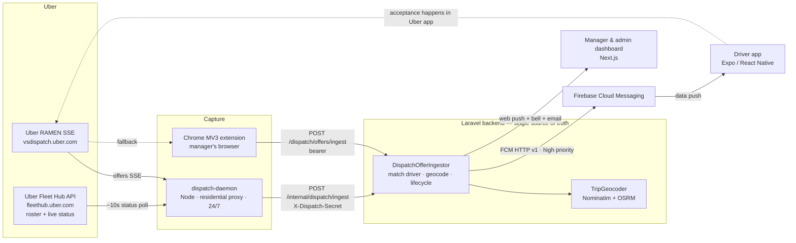

<p align="center">
  
</p>

<h1 align="center">Reidey</h1>

<p align="center"><strong>Catch every Uber offer in the 5-second window.</strong><br>
A multi-tenant SaaS for German Uber fleet operators — it captures each company's live Uber dispatch <em>offer</em> stream server-side and pushes every offer to the right driver instantly.</p>

<p align="center">Domain: <a href="https://reidey.de">reidey.de</a></p>

<p align="center">
  <a href="https://github.com/ahmaddev27/ridy/actions/workflows/ci.yml"></a>
  
  
  
  
  
  
  
</p>

---

## What it is

Reidey observes a fleet's **live Uber dispatch stream** (Uber's internal "RAMEN" server-sent-events channel), matches each incoming ride **offer** to the fleet's driver by their Uber UUID, and fires a **high-priority FCM push** to that driver's phone — with the fare, €-quality, pickup/dropoff and road distance — so the driver can judge the ride inside Uber's ~5-second accept window.

Crucially, Reidey **observes, it does not control**. It never accepts, rejects, or drives a trip. Acceptance still happens inside the Uber Driver app. Reidey watches Uber and *infers* the state of each offer (accepted / started / completed / canceled) from changes in the driver's live engagement status. This keeps the product on the right side of "detect, don't surveil / don't control."

Because Uber blocks datacenter IPs, the live stream is held either by a **Node daemon through a per-company residential proxy** (server-side, 24/7) or by a **Chrome extension running in the manager's own browser** (residential IP, manual fallback). Both feed the same Laravel backend, which is the single source of truth.

## Project status

> **Production — the MVP is complete and running live.** Day-to-day status lives in **[ROADMAP.md](./ROADMAP.md)**; the latest engineering changes are logged at the top of **[HANDOFF.md](./HANDOFF.md)**.

**Overall MVP progress** &nbsp; `▰▰▰▰▰▰▰▰▰▱` **95%**

| Area | Progress | Status |
| --- | :-- | :-- |
| Offer pipeline — capture → match → geocode → push | `▰▰▰▰▰` | ✅ Done |
| Driver app — Expo · OTP · offers · stats · push | `▰▰▰▰▰` | ✅ Done |
| Manager & super-admin dashboard | `▰▰▰▰▰` | ✅ Done |
| Notifications — FCM push · web push · email | `▰▰▰▰▰` | ✅ Done |
| Billing & multi-tenancy — codes · plans · proxies · collectors | `▰▰▰▰▰` | ✅ Done |
| Dispatch daemon — 24/7 · self-heal · sharding | `▰▰▰▰▰` | ✅ Done |
| Chrome extension — capture · Fleet Hub | `▰▰▰▰▰` | ✅ v1.15.4 |
| Geocoding & multi-stop detail | `▰▰▰▰▰` | ✅ Done |
| Live dashboard over WebSocket | `▰▰▰▰▰` | ✅ Done — dashboard, offers & driver map live on the isolated `company.{tenantId}` channel; poll is the fallback |
| iOS App Store release | `▰▰▰▰▱` | ⏳ Blocked (external) — Apple's DSA trader verification in review; nothing to build |
| Scale-out — self-hosted geo · sharding runbook | `▰▰▰▰▱` | 🔄 Self-hosted geo already live; sharding runbook ready to switch on when load needs it |

## Features

**Dispatch & offers**
- Live RAMEN offer capture per company, routed to the linked driver by `uber_driver_uuid`.
- Instant **FCM push** per offer (not polling): title `5.85 €€ | Peter`, body pickup → dropoff + `12.3 km · €1.26/km`.
- **€-quality** heuristic (`€` / `€€` / `€€€`) computed from price-per-km.
- Road distance, price/km and a route line from **Nominatim** (geocoding) + **OSRM** (routing), cached and rate-limit tolerant.
- Guarded, idempotent **offer lifecycle** (pending → accepted → started → completed / rejected / canceled) inferred from driver engagement edges, with a scheduled safety-net for stale offers.

**Driver app** (Expo / React Native)
- Email invite → activation → instant push per offer with a live accept-window countdown.
- Offer history, profile/stats, light/dark theme, i18n (de/en/ar, RTL for Arabic).
- Blocked automatically if the company's subscription lapses.

**Manager & super-admin dashboard** (Next.js)
- Company dashboard: live offers, offer detail with map, live driver map, drivers + stats, vehicles, Uber connection status, subscription.
- Super-admin: companies CRUD, per-company proxies, collectors/resellers, activation codes & plans, email templates, cross-tenant **system-health** page, admin broadcast.
- In-app bell + **FCM web push** to the browser so alerts arrive with the tab closed.

**Notifications**
- One `Notifier` writes a typed in-app bell notification, and (per user preference) also sends **FCM web push** and a **localized email** for important events.
- Categories: sessions, subscription, platform, codes. Admin broadcasts always deliver.

**Billing / tenancy**
- Activation codes, plans & subscription periods, collectors & resellers, per-company proxy pool (capacity measured in company slots), DSGVO-minded EU hosting.

**Platform**
- Strict **multi-tenancy** via a `BelongsToTenant` global scope; **Sanctum** auth with two guards (SPA cookie for the dashboard, bearer tokens for the driver app); **Spatie** roles/permissions.

## Architecture



## Tech stack

| Layer | Technology |
| --- | --- |
| Backend | Laravel 13 (PHP 8.3+; Docker image PHP 8.4-fpm), REST API, Sanctum, Spatie permissions |
| DB | SQLite (local dev), MySQL 8 (prod) |
| Frontend | Next.js 16 (App Router) · React 19 · Tailwind v4 (CSS-first tokens) · Leaflet · Firebase web push |
| Driver app | Expo SDK 52 · Expo Router · React Native 0.76 · expo-notifications (FCM) |
| Daemon | Node 20+ (ESM, `undici`) |
| Extension | Chrome MV3 |
| Push | Firebase Cloud Messaging (HTTP v1, service-account OAuth2) |
| Prod infra | Docker Compose + Caddy (auto-TLS) on a single VPS |

## Repo structure

```
reidey/
├─ backend/          # Laravel 13 REST API — domain-driven, multi-tenant, Sanctum
│  └─ app/Domain/{Dispatch,Fleet,Tenancy,Notifications,Billing,Collections,Audit}
├─ frontend/         # Next.js 16 manager + super-admin dashboard (en/de/ar)
├─ driver-app/       # Expo / React Native driver app (FCM push, de/en/ar)
├─ dispatch-daemon/  # Node daemon holding the RAMEN stream 24/7 via residential proxy
├─ extension/        # Chrome MV3 extension — manager-side Uber capture
├─ docker/           # Dockerfiles + Caddyfile + nginx config
├─ docs/             # Design, feasibility, deployment docs
├─ docker-compose.yml       # local/dev stack (MySQL, Redis, Horizon, nginx)
├─ docker-compose.prod.yml  # prod stack (Caddy, MySQL, backend, scheduler, frontend, daemon)
└─ HANDOFF.md        # full operational + architectural handbook
```

## Local dev quick-start

**Prerequisites:** PHP 8.3+, Composer 2, Node 20+ (22 recommended).

### Backend (SQLite — zero setup)

```bash
cd backend
composer install
cp .env.example .env
php artisan key:generate
touch database/database.sqlite
php artisan migrate --seed         # seed creates manager@fleet.de / password
php artisan serve                  # http://localhost:8000
```

Set `DISPATCH_INGEST_SECRET` in `backend/.env` (and match it in the daemon). For real
FCM push also set `FCM_CREDENTIALS` (path to a Google service-account JSON) and
`FCM_PROJECT_ID`; without them the backend logs pushes instead of sending.

### Frontend

```bash
cd frontend
npm install
npm run dev                        # http://localhost:3000
```

### Dispatch daemon

```bash
cd dispatch-daemon
cp .env.example .env               # set DISPATCH_INGEST_SECRET to match the backend
npm start                          # node src/index.js
```

### Driver app

```bash
cd driver-app
npm install
npm start                          # Expo dev server
# FCM push needs a development build (not Expo Go):
npx expo run:android
```

### Full stack via Docker (dev)

```bash
cp .env.example .env               # fill DB_* / APP_KEY / NEXT_PUBLIC_API_URL
docker compose up --build
# API via nginx: http://localhost:8080 · Frontend: http://localhost:3000
```

## Testing

```bash
cd backend
vendor/bin/pint --test             # code style
php artisan test                   # PHPUnit / feature tests (sqlite :memory:)
```

CI (`.github/workflows/ci.yml`) runs Pint + `php artisan test` on PHP 8.4, and
`npm ci` + `npm run build` for the frontend (lint is advisory).

## Documentation

- **[HANDOFF.md](./HANDOFF.md)** — the full operational + architectural handbook and **living agent guide** (mental model, per-subsystem deep-dive, data model, conventions, env/config, deployment, driver-app release, runbook, gotchas). It opens with a dated **change log** of the latest work — start there when resuming. Keep it updated in the same commit as any subsystem change.
- **[docs/](./docs)** — design, feasibility and deployment notes.
</content>
</invoke>
