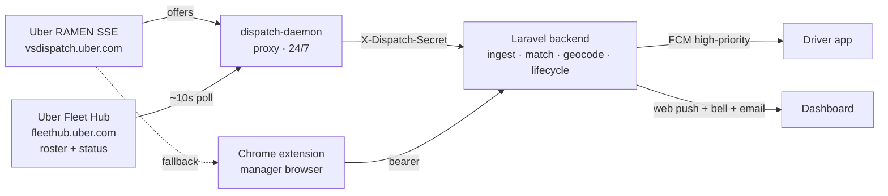

# التصميم التقني — Reidey

> **الحالة:** منتج حيّ. هذا الملف يعطي الصورة الهندسية العليا؛ **العمق** (الملفات والأصناف بالتحديد) في [`HANDOFF.md`](../HANDOFF.md) §2 — يُقرأ معه، لا بديلاً عنه.
> **ملاحظة تاريخية:** نسخة سابقة وصفت ستاك «Samsara/كشف رحلات شخصية» ملغى — تجاهلها.
> آخر تحديث: **2026-09-02**

---

## 1. المكوّنات الخمسة

| المكوّن | التقنية | الدور |
|---|---|---|
| **backend** | Laravel 13 / PHP 8.4، REST، Sanctum، Spatie | العقل ومصدر الحقيقة: استيعاب العروض، المطابقة، الجيوكودنغ، دورة الحياة، الدفع، الفوترة، تعدّد المستأجرين. خدمي الطبقات (Controllers → Services في `app/Domain/**` → Models). |
| **frontend** | Next.js 16 / React 19 / Tailwind v4 | لوحة المدير + الأدمن (de/en/ar، دارك مود). |
| **driver-app** | Expo SDK 52 / React Native 0.76 | تطبيق السائق (إشعارات FCM، تفاصيل العرض، عدّاد النافذة). |
| **dispatch-daemon** | Node (ESM، `undici`) | يمسك تيار RAMEN 24/7 لكل شركة عبر بروكسي سكني؛ يسحب الحالات (~10ث). |
| **extension** | Chrome MV3 (v1.15.4) | يلتقط جلسة أوبر + الروستر + الحالات من متصفّح المدير (IP سكني)؛ ناقل احتياطي للعروض. |

## 2. خط أنابيب العرض: التقاط → استيعاب → مطابقة → جيوكودنغ → دفع

1. **التقاط.** الديمون (أو الإضافة) يمسك عرض RAMEN من `vsdispatch.uber.com`.
2. **استيعاب.** يُرسَل إلى الباك:
   - الديمون: `POST /api/v1/internal/dispatch/ingest` بهيدر `X-Dispatch-Secret` (وسيط `dispatch.secret`).
   - الإضافة (جلسة مستخدم): `POST /api/v1/dispatch/offers/ingest` (وسيط `fleet.connected`).
   - يحلّ `DispatchOfferIngestor` المستأجر عبر `Tenant.uber_org_uuid = offer.partnerUUID`. **مُتكرّر-آمن (idempotent)** على `offer_uuid`.
3. **مطابقة.** `Driver.uber_driver_uuid = offer.driverInfo.driverUUID`. السعر يُفكّ من `formattedUFP`.
4. **جيوكودنغ.** `TripGeocoder` يحلّ الاستلام + الوجهة عبر **Nominatim**، ثم مسار **OSRM** → `distance_m` + `route_geometry`. مُخزّن (`geocode_cache`)، متسامح مع حدود المعدّل، بحدّ 5 محاولات. **`enrichForNotify()`** يعمل جيوكودنغ مقيّداً بزمن (~2.5ث) **قبل** الدفع فالإشعار لا يصل فاضياً؛ المحطات المتعددة تُحلّ per-leg.
5. **دفع.** `DispatchNotifier` يبني حمولة **بيانات-فقط** (الهاتف يوطّن): العنوان `‎5.85 €€ | Peter`، والجسم `استلام → وجهة` + سطر `‎12.3 km · €1.26/km`.

(كل خطوة في try/catch منفصل — فشل جيوكودنغ أو دفع لا يُضيع العرض.) الملفات بالتحديد: HANDOFF §2.1.

## 3. استنتاج دورة الحياة (لا تحكّم)

الحالات (`OfferStatus`): `Pending, Accepted, Started, Completed, Rejected, Canceled`. الانتقالات محروسة داخل معاملة DB مع `lockForUpdate()`، والانتقال غير المسموح **no-op** (idempotent) — `OfferLifecycle`.

الاستنتاج من **حالة السائق فقط** (`DriverStatusIngestor`): خامل → منشغل = قبول؛ `EN_ROUTE → ON_TRIP` = بدء؛ منشغل → خامل = اكتمل/أُلغي. **لا مصالحة زمنية** (جُرّبت وأُزيلت — قرار مثبّت). شبكات أمان مجدولة تنظّف العروض العالقة. التفصيل: HANDOFF §2.2.

## 4. قرارات تصميم كبرى

- **راقِب لا تتحكّم** — لا أكشن على أوبر إطلاقاً (invariant).
- **الباك مصدر الحقيقة الوحيد** — الديمون/الإضافة نواقل التقاط فقط.
- **بروكسي سكني** لأن أوبر يحجب الداتاسنتر.
- **FCM للجوال** (يوقظ التطبيق المغلق ضمن نافذة القبول) + **Reverb/WebSocket** للتحديث الحيّ (التطبيق حيّ عبره؛ اللوحة لسا polling — بند مفتوح في ROADMAP).
- **تعدّد مستأجرين صارم** عبر `BelongsToTenant` global scope؛ حارسان (`web` للّوحة، `driver` للتطبيق).
- **الطابور/الكاش = database** بالبرودكشن (حاوية `queue` مخصّصة + احتياطي الـscheduler)؛ Redis/Horizon للـdev فقط.

## 5. المخطط

**اقرأ للعمق:** [`HANDOFF.md`](../HANDOFF.md) (§2 المعمارية، §3 نموذج البيانات، §4 الاتفاقيات)، ومرجع النقاط: [`05-api-reference.md`](./05-api-reference.md).
